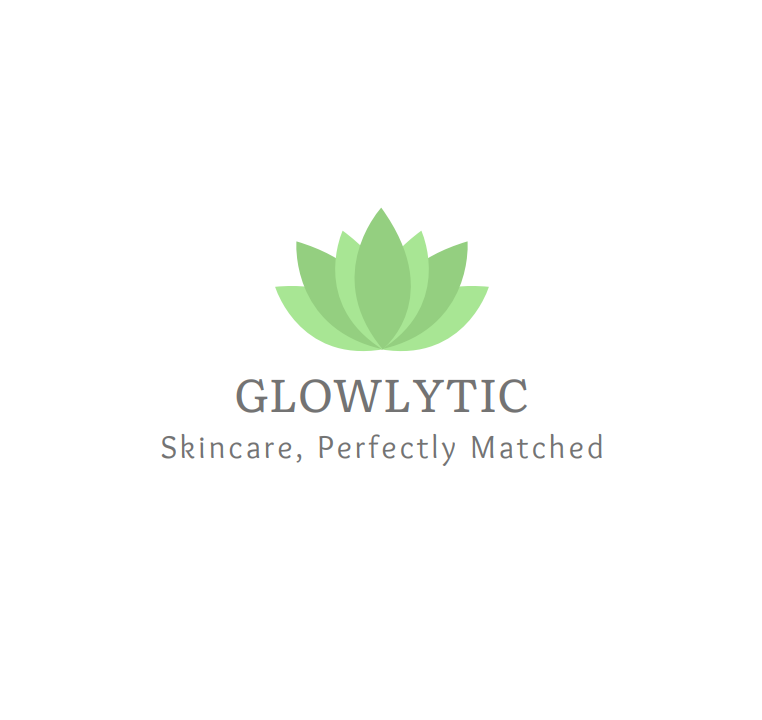

# Glowlytic

# 🌟 Glowlytic – Skincare Product Recommendation System

## 📌 Project Overview
Glowlytic is an AI-powered skincare product recommendation system designed to help users find the best skincare products based on their **skin concerns, skin type, and budget preferences**. By leveraging **machine learning and classification models**, Glowlytic provides personalized recommendations to improve the skincare shopping experience.

## 👨‍💻 Team Members
- Ghala Alsugair
- Daniah Alkathiri
- Nada Mahzari
- Najla Aljarba
- Daniah Alowifier

## 🎯 Motivation
Many people struggle to choose the right skincare products due to the **overwhelming number of options** available on the market. The main challenges include:  
✅ **Diverse Skin Concerns:** Acne, dryness, wrinkles, hyperpigmentation, sensitivity, and more.  
✅ **Too Many Choices:** Thousands of products make selection difficult.  
✅ **Generic Recommendations:** Many suggestions do not consider individual skin needs.  

Our motivation for this project is to build a **personalized, intelligent skincare recommendation system** that suggests products based on user inputs, helping users make better-informed skincare decisions.

## 📊 Dataset Attribution
This project uses a dataset created by **Dwi Ayu Nouvalina**, licensed under the MIT License.  
Source: [🔗 GitHub Repository](https://github.com/Yunanouv/Skin-Care-Recommender-System) .

🔹 *Glowlytic – Making Skincare Smarter!* ✨
 

